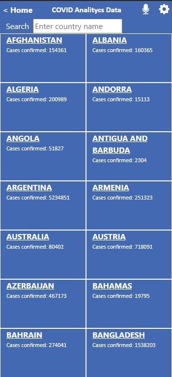

# Metrics Webapp Captstone Project

Web application that fetch big ammount of data from API and populate them in a component depending on the route.

   

## :red_circle: Live Demo

- [Netlify](https://covid-metrics-data.netlify.app/) 

## :hammer: Built With

- React and Javascript.

To get a local copy up and running follow these simple steps:

1. Go to the [repository page](https://github.com/carloso0114/React-metrics-webapp).
2. Press the "Code" button and copy the link.
3. Clone it using git command `git clone <link>`.
4. In the project folder run `npm install`
5. Then run in the terminal `npm run start` (for development enviroment) or `npm run build`

## :blue_book: Learning Objectives

- Use React documentation.
- Use React components.
- Use React props.
- Use React Router.
- Connect React and Redux.
- Handle events in a React app.
- Write unit tests with React Testing Library.
- Use styles in a React app.
- Use React life cycle methods.
- Apply React best practices and language style guides in code.
- Use store, actions and reducers in React.
- Perform a code review for a team member.

## Authors

👤 **Carloso0114**

- GitHub: [@carloso0114](https://github.com/carloso0114)
- LinkedIn: [Carlos Ospina](https://www.linkedin.com/in/carlosospina/)

## 🤝 :raised_hand: :raised_hand: Contributions

Contributions, issues, and feature requests are welcome!

Feel free to check the [issues page](https://github.com/carloso0114/React-metrics-webapp/issues).

## :grey_exclamation: Acknowledgments

- [Microverse](https://www.microverse.org/)
- Original design idea by Nelson Sakwa on Behance.

## 📝 License

This project is [MIT](LICENSE) licensed.
